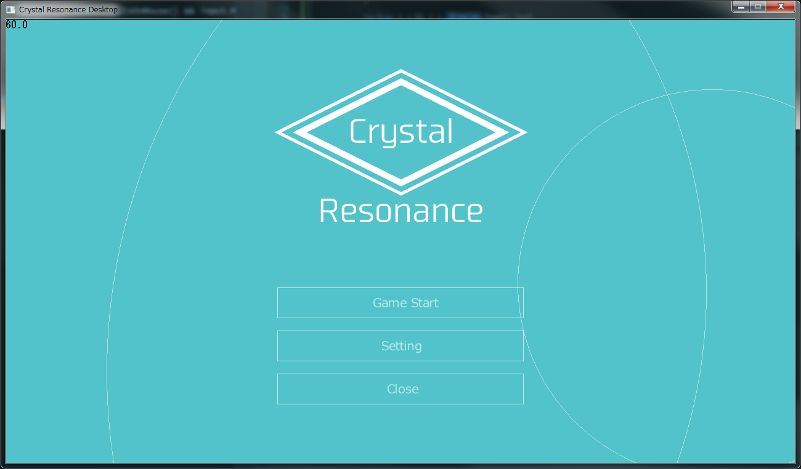
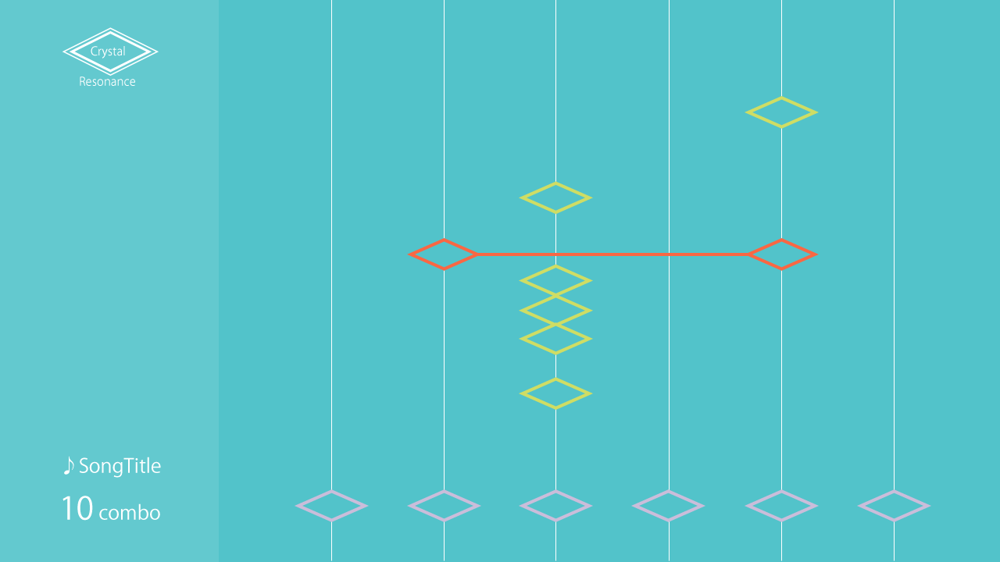

# Crystal Resonance for Desktop

This software is music game for Windows Desktop.

image of game play:

## Used libraries
- DxSharp (closed source)
- [YoutubeExtractor](https://github.com/flagbug/YoutubeExtractor)

## Used binaries
- [ffmpeg](https://ffmpeg.zeranoe.com)

## License
basic released under the [MIT license](LICENSE)

**However, that this shall not apply to following provided resource by other people**

## Special Thanks (Not inclued non built-in resource)
- しゃおん
  - Song: Opening
